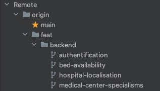

# Workflow Git

Le workflow git est constitué sur la base du one-trunck-based-development afin de garantir un historique linéaire le plus lisible possible.
Pour l’établissement du POC, les branches créées pourront être mergées directement sur la branche principale (main) par le biais d’une pull request mais une branche de développement devra être instaurer pour l’industrialisation du développement.
## Stratégie de nommage des branches
Afin de garantir la lisibilité de l’historique, une convention de nommage est mise en place pour la création des branches. Les branches seront ainsi nommées sur le modèle suivant :
```
type/tag/description
```
Cette méthode permet aussi de garantir un affichage cohérent dans l’IDE.



### Type
Les types de branche disponibles sont :
- Feat : pour le développement de fonctionnalité spécifique
- Fix : afin de corriger une erreur de comportement ou un bug informatique
- Chore : pour tout ce qui concerne la configuration générale de l’application
### Tag
Les tags disponibles sont :
- CI : pour les éléments concernant la mise en place de l’intégration continue
- Backend : pour les éléments concernant l’application backend
- Frontend : pour les éléments concernant l’application frontend
- Full : pour les éléments concernant l’application backend et l’application frontend
### Description
La description de la branche doit permettre d’identifier rapidement l’objectif des modifications apportées comme le nom d’une fonctionnalité par exemple.
La description doit rester courte et ne comporter aucun espace mais plutôt des tirets.
## Stratégie de nommage des commits
Afin de garantir la lisibilité de l’historique, une convention de nommage est mise en place pour la création des commits. Les commits seront ainsi nommées sur le modèle suivant :
```
type(tag1, tag2, … , tagN) : description
```
Cette méthode permet à terme de faciliter l’analyse des commits.
### Type
Les types de branche disponibles sont :
- Feat : pour le développement de fonctionnalité spécifique
- Fix : afin de corriger une erreur de comportement ou un bug informatique
- Chore : pour tout ce qui concerne la configuration générale de l’application
### Tag
Les tags disponibles sont :
- CI : pour les éléments concernant la mise en place de l’intégration continue
- Backend : pour les éléments concernant l’application backend
- Frontend : pour les éléments concernant l’application frontend
Il est possible d’indiquer plusieurs tags pour un seul commit.
### Description
La description du commit doit permettre d’identifier rapidement les modifications apportées à l’aide d’une phrase complète
